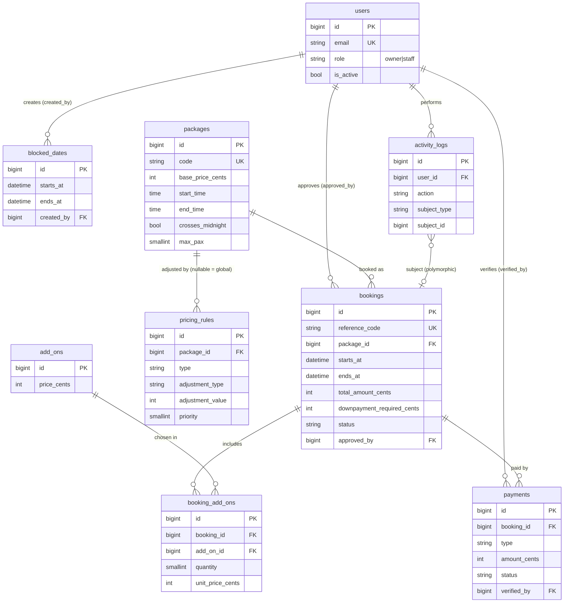

# Database

> Purpose: schema reference — tables, columns, relationships, indexes and data conventions.

## Conventions (naming, money, timestamps, soft deletes)

- **Engine:** PostgreSQL 15+ (D-014). Tests run on the separate database `wonderpool_test`.
- **JSON:** `jsonb` columns (`pricing_rules.days_of_week`, `activity_logs.properties`); key order is not preserved.
- **Emails:** stored trimmed and lowercase (User `email`, Booking `guest_email` mutators) because PostgreSQL comparisons are case-sensitive; search text with `ILIKE`.
- **Money:** integer centavos in `*_cents` columns (`700000` = ₱7,000.00). Format only for display via `App\Support\Money::format()` (D-001).
- **Enums:** stored as `string(20)` columns (no native enum types), cast to PHP enums in `app/Enums` (see HISTORY.md "Enums").
- **Time windows:** `starts_at`/`ends_at` are half-open `[start, end)`. Two windows overlap when `a.starts_at < b.ends_at AND a.ends_at > b.starts_at`; touching boundaries do **not** overlap.
- **Timezone:** datetimes are stored as local Asia/Manila wall-clock time (app timezone; D-009).
- **Snapshots:** bookings copy `total_amount_cents`, and `booking_add_ons` copy `unit_price_cents`, so later price edits never change old bookings.
- **Soft deletes:** `bookings` only. Everything else is hard-deleted or deactivated with `is_active`/`is_visible`.
- **Foreign keys:** explicit; `restrict` where history must be kept (package, add-on), `cascade` for owned children, `set null` for "who did it" user columns.

## Entity-relationship overview

Standalone content tables (no foreign keys): `amenities`, `gallery_images`, `faqs`, `settings`.

## Tables

### users
| Column | Type | Notes |
|---|---|---|
| id | bigint PK | |
| name, email (unique, lowercase), password | string | Laravel default |
| role | string(20) | `UserRole`: owner, staff (default staff) |
| is_active | bool | Disabled users cannot sign in (M2) |
| email_verified_at, remember_token, timestamps | | Laravel default |

Indexes: `email` unique, `(role, is_active)`.

### packages
| Column | Type | Notes |
|---|---|---|
| name | string | e.g. "Night Package (D)" |
| code | string(20) unique | e.g. `DAY-A`, `NIGHT-D`, `24H` |
| description | text null | |
| base_price_cents | uint | ₱ × 100 |
| start_time, end_time | time | Local wall-clock |
| crosses_midnight | bool | end_time is on the next day |
| max_pax | usmallint | |
| is_active | bool | Inactive = not bookable |
| sort_order | usmallint | Display order |

Indexes: `code` unique, `(is_active, sort_order)`.

### add_ons
| Column | Type | Notes |
|---|---|---|
| name, description | string, text null | |
| price_cents | uint | |
| is_active | bool | |

### pricing_rules
| Column | Type | Notes |
|---|---|---|
| package_id | FK null → packages (cascade) | NULL = all packages |
| name | string | |
| type | string(20) | `PricingRuleType`: weekend, holiday, season |
| starts_on, ends_on | date null | Date range (season/holiday) |
| days_of_week | jsonb null | ISO weekdays, 1 = Mon … 7 = Sun |
| adjustment_type | string(20) | `PricingAdjustmentType`: percent, fixed |
| adjustment_value | int (signed) | percent points, or centavos for fixed |
| priority | usmallint | Applied in ascending order (M4) |
| is_active | bool | |

Indexes: `(is_active, priority)`, `(starts_on, ends_on)`.

### bookings
| Column | Type | Notes |
|---|---|---|
| reference_code | string(20) unique | e.g. `WP-7K3MQ9XA`; generator in M4 |
| package_id | FK → packages (restrict) | |
| guest_name, guest_phone, guest_email | string, string(20), string null | Phone in E.164 (`+639…`) |
| event_type | string(100) null | |
| guest_count | usmallint | |
| notes | text null | Guest notes |
| starts_at, ends_at | datetime | Resolved window, used for overlap checks |
| total_amount_cents | uint | Price snapshot |
| downpayment_required_cents | uint | |
| status | string(20) | `BookingStatus`: pending, approved, rejected, cancelled, completed |
| rejection_reason, admin_notes | text null | |
| approved_by | FK null → users (set null) | |
| approved_at | timestamp null | |
| timestamps, deleted_at | | Soft deletes |

Indexes: `reference_code` unique, `(starts_at, ends_at)`, `status`, `guest_phone` (track-booking lookup).

### booking_add_ons
| Column | Type | Notes |
|---|---|---|
| booking_id | FK → bookings (cascade) | |
| add_on_id | FK → add_ons (restrict) | |
| quantity | usmallint | default 1 |
| unit_price_cents | uint | Price snapshot |

Indexes: unique `(booking_id, add_on_id)`.

### payments
| Column | Type | Notes |
|---|---|---|
| booking_id | FK → bookings (cascade) | |
| type | string(20) | `PaymentType`: downpayment, balance, full |
| amount_cents | uint | |
| proof_path | string null | Private disk path (M4/M6) |
| status | string(20) | `PaymentStatus`: pending, verified, rejected |
| reference_no | string(100) null | GCash/bank reference |
| verified_by | FK null → users (set null) | |
| verified_at | timestamp null | |

Indexes: `(booking_id, status)`, `status`.

### blocked_dates
| Column | Type | Notes |
|---|---|---|
| starts_at, ends_at | datetime | `[start, end)` |
| reason | string | |
| created_by | FK null → users (set null) | |

Indexes: `(starts_at, ends_at)`.

### amenities
| Column | Type | Notes |
|---|---|---|
| name, description | string, text null | |
| icon | string(50) | Heroicon outline name, e.g. `sun` |
| image_path | string null | |
| is_active, sort_order | bool, usmallint | |

### gallery_images
| Column | Type | Notes |
|---|---|---|
| path, caption | string, string null | |
| category | string(20) | `GalleryCategory`: pools, rooms, hall, events |
| is_visible, sort_order | bool, usmallint | |

Indexes: `(category, is_visible, sort_order)`.

### faqs
| Column | Type | Notes |
|---|---|---|
| question, answer | string, text | |
| sort_order, is_active | usmallint, bool | |

### settings
| Column | Type | Notes |
|---|---|---|
| key | string(100) unique | Dotted, e.g. `booking.downpayment_percent` |
| value | text null | Always a string; cast in SettingService (M2+) |
| group | string(50), indexed | general, booking, payment, contact, social |

The key list is in HISTORY.md under "Settings Keys".

### activity_logs
| Column | Type | Notes |
|---|---|---|
| user_id | FK null → users (set null) | NULL = system/guest |
| action | string(100) | e.g. `booking.approved` |
| subject_type, subject_id | morph, nullable | Target record |
| properties | jsonb null | Before/after details |
| created_at | timestamp | No updated_at (append-only) |

Indexes: `action`, `created_at`, `(subject_type, subject_id)`.

## Seeders & factories

| Seeder | Creates | Idempotency |
|---|---|---|
| `OwnerSeeder` | Owner user from `OWNER_NAME/EMAIL/PASSWORD` (.env); skips when unset | updateOrCreate by email |
| `PackageSeeder` | DAY-A ₱7,000 (7AM–5PM), NIGHT-D ₱9,000 (7PM–5AM), 24H ₱15,000 (7AM–5AM) | updateOrCreate by code |
| `AmenitySeeder` | 8 amenities with heroicon names | updateOrCreate by name |
| `SettingSeeder` | Default settings (placeholders for contact/payment) | firstOrCreate by key; never overwrites edits |
| `FaqSeeder` | 6 starter FAQs | updateOrCreate by question |

Run with `php artisan migrate:fresh --seed`. Every model has a factory (`database/factories`). Booking and user factories share the Philippine sample data in `Concerns/PhilippineData` (names, `+639…` mobiles). Useful states: `Booking::factory()->approved()|rejected()|cancelled()|completed()|forPackageOn($pkg, $date)|window($s, $e)`, `Package::factory()->overnight()`, `User::factory()->owner()`.
